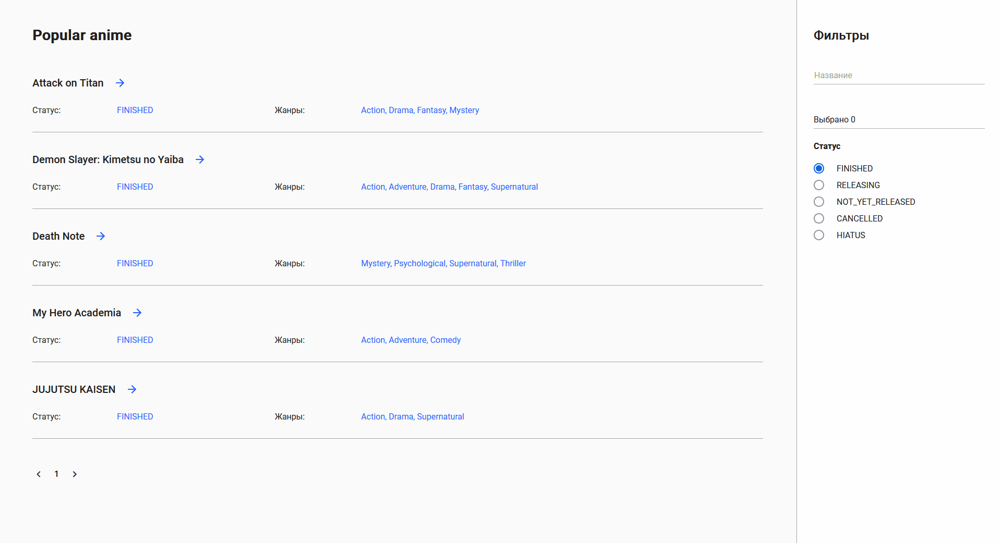

# AnimeList

Search anime using GraphQL API [AniList API](https://github.com/AniList/ApiV2-GraphQL-Docs). Pet project for learning Angular

## Features

- Filter by status and genre
- See detailed view by clicking on a card

## What have I learned

- How components work in Angular
- How to use forms, how to connect data and view with two-way binding
- How to cache components while navigating routes

## How to install and run

Run `ng serve` for a dev server. Navigate to `http://localhost:4200/`. Run `ng build` to build the project. The build artifacts will be stored in the `dist/` directory.
